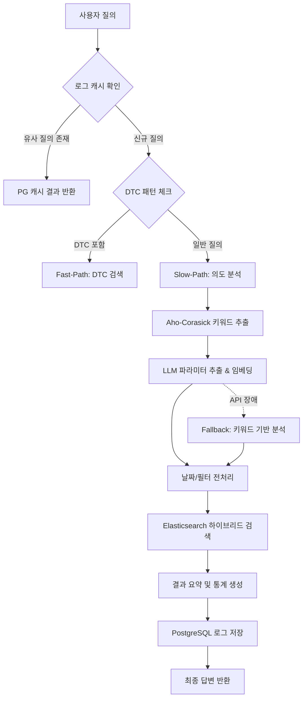

# 프로그램 정의서 (Program Specification)

**프로젝트 명**: Elastic Hybrid Search 기반 의도 분석 및 정비 데이터 검색 시스템  
**버전**: v1.4  
**작성일**: 2026-05-15  

---

## 1. 개요 (Overview)
본 시스템은 대규모 차량 정비 데이터(Claims)와 고장코드(DTC) 정보를 효율적으로 검색하고 분석하기 위해 설계되었습니다. 단순 키워드 검색을 넘어, 사용자의 자연어 질의에서 의도(Intent)를 파악하고 통계적 집계 및 의미적 유사도(Semantic) 검색을 결합한 하이브리드 검색 기능을 제공합니다.

---

## 2. 시스템 아키텍처 (System Architecture)

### 2.1. 전체 흐름도
질의 처리 프로세스는 성능과 정확도의 균형을 위해 3단계(Fast-Path, Slow-Path, Fallback)로 구성됩니다.



---

## 3. 데이터베이스 설계 (Database Design)

### 3.1. Elasticsearch (검색 엔진)
- **Index**: `jjc_claim_nori_v1` (또는 환경변수 설정값)
- **핵심 필드**:
    - `현상` (Text): 차량 고장 현상 (BM25 검색용)
    - `조치내용` (Text): 수리 조치 사항
    - `content_vector` (Dense Vector, 1536 dim): 의미적 유사도 검색용
    - `차종`, `부품명` (Keyword): 필터링 및 집계용
    - `확정일자` (Date): 기간 검색용

### 3.2. PostgreSQL (로그 및 캐시)
- **Table**: `query_logs`
- **핵심 컬럼**:
    - `query_text` (Text): 사용자 원문
    - `tokens` (Text): 형태소 분석 결과
    - `intent` (Varchar): 분석된 의도 (similar_case, trend_analysis 등)
    - `parameters` (JSONB): 추출된 상세 조건 (model, symptom, date_range 등)
    - `query_vector` (Vector, 1536 dim): `pgvector`를 이용한 질의 유사도 검색용

---

## 4. 주요 기능 및 알고리즘 (Core Functions)

### 4.1. 동적 키워드 매칭 (Aho-Corasick)
- 서비스 기동 시 ES 인덱스의 `차종`, `부품명`, `현상` 필드에서 유니크한 값을 추출하여 메모리 기반 오토마타를 구성합니다.
- 사전 정의되지 않은 신규 차종이나 부품이 추가되어도 별도의 코드 수정 없이 인식 가능합니다.

### 4.2. LLM 기반 의도 분석 (GPT-4o)
- 사용자의 질문에서 다음 요소를 추출합니다:
    - **Intent**: 정비 사례 검색, 통계 분석, DTC 원인 분석 등
    - **Parameters**: 차종, 증상, 부품, 기간, 정렬 순서
- 추출된 정보를 바탕으로 ES 쿼리를 동적으로 생성합니다.

### 4.3. 하이브리드 검색 (Hybrid Search)
- **BM25**: 형태소 기반의 정확한 키워드 매칭
- **kNN (Vector Search)**: 문맥적 유사성을 기반으로 한 검색
- 두 결과를 적절히 결합하여 최적의 검색 순위를 결정합니다.

---

## 5. API 명세 (API Specification)

### 5.1. 검색 API
- **Endpoint**: `POST /api/data/search`
- **Payload**:
    ```json
    { "query": "string" }
    ```
- **Response**:
    - `route`: 분석 경로 (fast-path/slow-path)
    - `intent`: 파악된 의도
    - `parameters`: 추출된 조건
    - `answer`: LLM이 생성한 자연어 요약 답변
    - `top_statistics`: 통계 분석 시 포함되는 집계 결과
    - `results`: 검색된 로우 데이터 (최대 10건)

---

## 6. 운영 및 유지보수 (Operations)

- **환경 변수**: `.env` 파일을 통해 API 키 및 DB 접속 정보를 관리합니다.
- **초기화 스크립트**:
    - `scripts/init_db.py`: PostgreSQL 스키마 생성
    - `scripts/create_nori_index.py`: ES 인덱스 및 매핑 생성
- **빌드**: `PyInstaller`를 사용하여 독립 실행형 파일로 배포 가능합니다.

---

**[문서 끝]**
