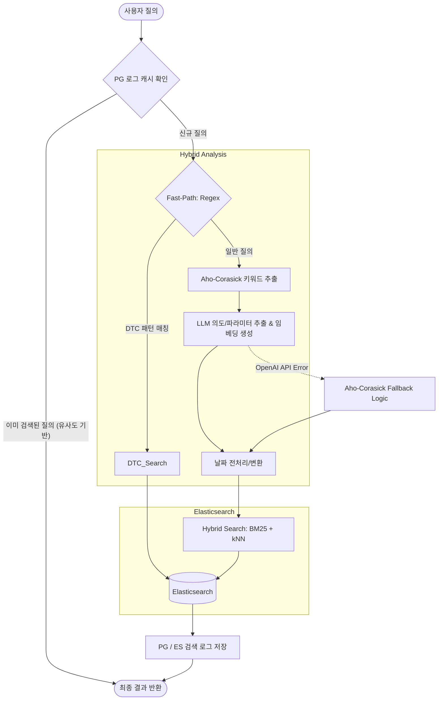

# 🚀 Elastic Hybrid Search 기반 의도 분석 및 정비 데이터 검색 API (v0.01)

차량 정비 데이터(Claims) 및 고장코드(DTC)를 분석하여 사용자 질의의 의도를 파악하고, **Aho-Corasick 고속 패턴 매칭**, **PostgreSQL 로그 캐싱**, 그리고 **LLM 기반 하이브리드 검색**을 결합하여 최상의 성능과 안정성을 제공하는 차세대 검색 시스템입니다.

---

## 1. 시스템 아키텍처 (Advanced Architecture)

본 시스템은 다단계 분석 파이프라인을 통해 효율적으로 질의를 처리하며, 장애 발생 시 자동으로 Fallback 로직을 가동합니다.



---

## 2. 기술 스택 (Tech Stack)

| 구분 | 기술 | 주요 역할 |
| :--- | :--- | :--- |
| **Framework** | **FastAPI** | 비동기 API 엔드포인트 서빙 |
| **Database** | **Elasticsearch** | BM25 텍스트 검색 및 kNN 밀집 벡터 검색 |
| **Log DB** | **PostgreSQL** | 검색 로그 저장 및 질의 캐싱 (VECTOR 연산 활용) |
| **Matching** | **Aho-Corasick** | 대규모 키워드(차종, 부품명) 고속 패턴 매칭 |
| **AI/LLM** | **OpenAI API** | GPT-4o (의도 분석), text-embedding-3-small (임베딩) |
| **Async I/O** | **Asyncpg / Aiohttp** | 데이터베이스 및 외부 API 비동기 통신 최적화 |

---

## 3. 핵심 기능 (Key Features)

### 3.1. 지능형 3단계 의도 분석
*   **Level 1 (Regex)**: 고장코드(DTC, 예: P2261) 패턴을 즉시 포착하여 고속 라우팅.
*   **Level 2 (Aho-Corasick)**: 수만 건의 차종, 부품명 사전을 기반으로 밀리초(ms) 단위의 키워드 추출.
*   **Level 3 (LLM)**: GPT-4o를 통해 복잡한 문맥 파악, 상세 파라미터(증상, 날짜) 추출 및 벡터 생성.

### 3.2. 자연어 답변 생성 (Conversational AI)
*   **LLM 기반 요약**: 검색된 수많은 정비 로그를 분석하여, 사용자의 질문에 대한 핵심 답변을 자연스러운 한국어 문장으로 생성합니다.
*   **지식 합성**: 여러 사례에서 공통적으로 나타나는 원인이나 해결 방법을 종합하여 전문가 수준의 조언을 제공합니다.

### 3.3. 고급 통계 분석 (Smart Aggregation)
*   **동적 정렬 기능**: "가장 많은", "가장 적은" 등의 사용자 의도를 파악하여 통계 데이터를 오름차순(ASC) 또는 내림차순(DESC)으로 정렬하여 반환합니다.
*   **필드별 집계**: 증상(`상세내용`), 부품명 등을 기준으로 실시간 발생 빈도를 계산합니다.

### 3.4. 고성능 로그 캐싱 (Semantic Query Caching)
*   **PostgreSQL 벡터 검색**: 사용자의 신규 질의와 유사한 이전 질의가 있을 경우, DB에서 즉시 결과를 반환하여 OpenAI API 비용을 0원으로 절감.
*   **학습 데이터 자동 축적**: 모든 분석 결과는 PostgreSQL에 저장되어 향후 모델 학습이나 통계 분석에 활용됩니다.

### 3.5. 견고한 장애 대응 (Robust Resilience)
*   OpenAI API 할당량 초과(429) 또는 네트워크 장애 시, **Aho-Corasick 기반의 키워드 추출 결과로 자동 Fallback**하여 중단 없는 서비스를 제공합니다.

---

## 4. 디렉토리 구조 (Directory Structure)

```text
Analyer0.0/
├── app/
│   ├── api/          # FastAPI Router (search.py)
│   ├── analyze/      # IntentAnalyzer (Aho-Corasick + Regex + LLM)
│   ├── service/      # SearchService (ES Hybrid Query Builder)
│   ├── conn/         # DB Connection (es_conn.py, pg_conn.py)
│   ├── llm/          # OpenAI Service (Completion, Embedding)
│   ├── utils/        # Common Utilities (Date parsing, Tokenizing)
│   └── main.py       # API 앱 정의 및 Lifecycle 관리
├── scripts/          # 운영 스크립트 (setup_es.py, init_db.py, check_db.py 등)
├── main.py           # 전체 애플리케이션 진입점 (Uvicorn 실행)
├── test.http         # API 테스트용 HTTP 샘플
├── project_build.spec# PyInstaller 빌드 설정
├── requirements.txt  # 의존성 리스트
└── .env              # 설정 정보
```

---

## 5. 설치 및 시작하기 (Installation)

### 5.1. 환경 설정
1.  `.env.example` 파일을 복사하여 `.env` 파일을 생성합니다.
2.  `OPENAI_API_KEY`, `ES_HOST`, `PG_DSN` 등을 환경에 맞게 수정합니다.

### 5.2. 초기화 스크립트 실행
```bash
# 1. PostgreSQL 테이블 생성 (logs 테이블 등)
python scripts/init_db.py

# 2. Elasticsearch 인덱스 및 매핑 설정
python scripts/setup_es.py
```

### 5.3. 서비스 실행
```bash
python main.py
```
*   서버는 기본적으로 `http://localhost:8000`에서 실행됩니다.

---

## 6. API 사용법 (Usage)

### **POST /api/data/search**
하이브리드 분석 엔진을 통한 검색 결과를 반환합니다.

**Request Body (1): 통계 분석**
```json
{
  "query": "1월에 가장 많이 발생한 증상이 뭐야?"
}
```

**Request Body (2): 원인 분석**
```json
{
  "query": "그랜저 엔진 진동 원인이 뭐야?"
}
```

**Response (Example):**
```json
{
  "route": "slow-path",
  "intent": "trend_analysis",
  "parameters": {
    "sort_order": "desc",
    "start_date": "20260101",
    "end_date": "20260131"
  },
  "answer": "2026년 1월 한 달간 가장 많이 발생한 증상은 '엔진 부조'와 '시동 불량'입니다...",
  "top_statistics": [
    {"symptom": "엔진 부조", "count": 45},
    {"symptom": "시동 불량", "count": 32}
  ],
  "source": "llm_analysis",
  "results": [...]
}
```

---

## 7. 모니터링 및 문제 해결 (Troubleshooting)

1.  **PostgreSQL 연결 오류**: `check_db.py` 스크립트를 실행하여 DB 연결 상태 및 테이블 구조를 확인하세요.
2.  **Elasticsearch 검색 실패**: `check_mapping.py`를 통해 인덱스 매핑이 최신 상태인지 확인하세요.
3.  **LLM 할당량 초과**: 시스템은 자동으로 `Aho-Corasick` 모드로 전환되지만, `.env`에서 API 키를 확인하거나 할당량을 증설해야 합니다.

---

## 8. 빌드 (Build)

독립 실행형 파일(.exe)로 빌드하려면 다음 명령어를 사용합니다:
```bash
pyinstaller project_build.spec
```
빌드된 결과물은 `dist/` 폴더 내에 생성됩니다.
