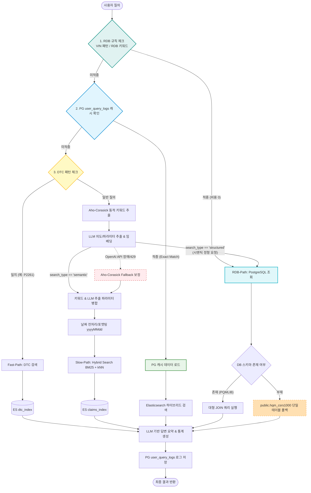

# 🚀 Elastic Hybrid Search 기반 의도 분석 및 정비 데이터 검색 API (v1.5)

차량 정비 데이터(Claims) 및 고장코드(DTC)를 비동기로 신속하게 분석하고 검색하는 최첨단 하이브리드 검색 시스템입니다. **Aho-Corasick 동적 키워드 오토마타**, **PostgreSQL 캐시 데이터베이스**, **OpenAI GPT-4o 기반 의도/파라미터 추출 및 1536차원 임베딩**, **Elasticsearch BM25 + kNN 하이브리드 검색**, 그리고 **실시간 RDB 직접 조회 및 2단계 자동 폴백 기능**을 하나로 결합하여 최상의 응답 속도와 완벽한 안정성을 제공합니다.

---

## 1. 🌟 주요 업데이트 사항 (v1.5)

*   **⚡ 실시간 RDB 직접 조회 경로 (`rdb-path`) 추가**:
    *   사용자가 실시간 정형 데이터, 특정 차량 차대번호 원장, 정비 이력 목록 등을 요구할 경우, Elasticsearch 캐시 및 인덱스 조회를 우회하고 **PostgreSQL 관계형 데이터베이스를 직접 실시간 조회**하여 가장 최신의 정형 로우(Row) 데이터를 반환합니다.
*   **🧠 규칙(Regex/Aho-Corasick) + LLM 시맨틱 분류의 하이브리드 RDB 판별 (Option C)**:
    *   **1단계 규칙 판별 (비용 $0)**: 17자리 차량 고유 차대번호(VIN) 정규식 매칭 및 RDB 특화 단어(`"원장"`, `"차대번호"`, `"캠페인 번호"`, `"로우 데이터"` 등) 사전이 매칭되면 LLM 호출 없이 즉시 RDB 조회로 분기합니다.
    *   **2단계 LLM 시맨틱 판별**: 규칙 매칭이 안 된 일반 질문의 경우, GPT-4o가 질문의 문맥을 분석하여 구체적인 로우 레코드 목록 조회를 원하는 경우(`search_type == "structured"`) 자동으로 `rdb-path`로 시맨틱 라우팅합니다.
*   **🔄 RDB 2단계 자동 스키마 폴백 (Auto-Fallback)**:
    *   사용자가 제공한 복잡한 대형 JOIN 쿼리(`PQMLIB` 스키마 및 디코딩 함수 조인 형태)를 최우선 실행하되, 로컬 개발/검증 환경처럼 해당 스키마가 없는 경우 **실제 존재하는 단일 테이블(`public.hqm_csrs1000`)로 안전하게 2차 자동 폴백 질의를 재구성하여 무중단 조회**를 수행합니다.
*   **📊 로컬 데이터 기반 증상 통계(Top Symptoms) 실시간 집계**:
    *   RDB 데이터를 가져올 때도 Elasticsearch 집계와 동일한 아웃풋 구조를 갖추기 위해, 가져온 결과셋 내에서 최빈 증상 상위 10개를 Python 로컬 메모리상에서 실시간으로 집계해 완벽한 정합성을 제공합니다.
*   **🛡️ 다국어/다양한 DB 컬럼 매핑 완벽 대응**:
    *   OpenAI 답변 생성 모듈(`generate_answer`)이 Elasticsearch의 한글 키(`차종`, `부품명`, `현상`, `상세내용`)와 PostgreSQL RDB의 영문 대소문자 컬럼 키(`PRJ_NM`, `ITMNM`, `SIG_CONT`, `ro_tx` 등)를 모두 동시 지원하도록 설계하여 답변 요약 품질을 극대화했습니다.
*   **🛠️ 개발자 디버그 사용성 개선 (Path Guard)**:
    *   `analyzer.py` 단독 파일 실행 시 `ModuleNotFoundError: No module named 'app'` 에러를 원천 방어하도록 상위 프로젝트 루트 경로를 탐색해 `sys.path`에 주입하는 **자동 경로 보정 코드**를 탑재하여 로컬 디버깅 및 단일 파일 실행 편의성을 획기적으로 올렸습니다.
*   **⚡ 4.5만 건 실데이터 기반 동적 사전 적재 (Dynamic Aho-Corasick Update)**:
    *   `analyzer.py` 내부에 `dotenv.load_dotenv()`를 독립 이중 배치하여 단독 구동 시에도 환경 변수를 완벽히 스캔합니다. 비어있던 `jjc_claim_nori_v1` 대신 45,713건의 클레임 실데이터가 적재된 **`jjc_20260518_claim_test_index`** 인덱스로부터 차종, 부품, 증상 목록을 최우선적으로 동적 적재하여 Aho-Corasick 매칭 사전을 최신 상태로 유지합니다.

---

## 2. 🏛️ 시스템 아키텍처 (System Architecture)

본 시스템은 다중 경로 파이프라인으로 구성되어 속도와 의미적 정확도, 정형 데이터 직접 검색 요구사항을 완벽히 만족시킵니다.



---

## 3. 🛠️ 기술 스택 (Tech Stack)

| 레이어 | 기술 | 주요 역할 및 설명 |
| :--- | :--- | :--- |
| **Framework** | **FastAPI** | 비동기 비즈니스 로직 서빙 및 Unicode 전용 JSON 비동기 Response 관리 |
| **Search Engine**| **Elasticsearch** | **Nori 형태소 분석기** 기반 텍스트 매칭 및 **kNN 밀집 벡터 검색** 기능 제공 |
| **Database** | **PostgreSQL** | `user_query_logs` 캐싱 테이블 및 실시간 **hqm_csrs1000 원장 테이블** 직접 조회 처리 |
| **Automata** | **Aho-Corasick** | ES 인덱스에서 로드한 수만 개의 키워드를 **O(N) 속도로 실시간 추출** |
| **AI / LLM** | **OpenAI API** | `gpt-4o` 기반의 파라미터/의도 분석 및 `text-embedding-3-small` 임베딩 생성 |
| **Concurrency** | **Asyncpg / Aiohttp**| DB 연결 풀링 관리 및 비동기 API 통신을 통한 극대화된 IO 성능 보장 |

---

## 4. 💎 핵심 기능 및 비즈니스 로직 (Core Features)

### 4.1. 지능형 4단계 의도 분석 및 다중 경로 파이프라인
1.  **Fast-Path (DTC 정규식 매칭)**: 고장코드(예: `P2261`) 감지 시, 즉각적으로 DTC 백과사전 테이블 검색으로 라우팅합니다.
2.  **RDB-Path (정형 데이터 조회)**: 
    *   차대번호(VIN) 혹은 핵심 DB 관련 키워드가 일치하는 경우(규칙기반), 또는 질문의 성향이 정형 리스트 조회를 요구하는 경우(LLM 시맨틱기반) Elasticsearch를 타지 않고 실시간 PostgreSQL DB 검색으로 빠집니다.
3.  **Slow-Path (Aho-Corasick + LLM 하이브리드)**:
    *   **Aho-Corasick**: 사용자가 입력한 자연어에서 실제 차량 도메인 키워드(`차종`, `부품명`, `현상`)를 유실 없이 포착합니다.
    *   **LLM 파라미터 추출**: 질문의 의미적 맥락(Intent), 정렬 순서, 그리고 기간 조건을 명확하게 파악합니다.
4.  **Fallback Safe-Guard**: OpenAI 호출 에러 시, Aho-Corasick가 감지한 핵심 토큰들을 기반으로 기본값 파라미터를 보정하여 안전하게 검색 프로세스를 마칩니다.

### 4.2. RDB 2단계 안정형 폴백 조회 엔진
*   **고가용성 확보**: 운영계에 설치된 `PQMLIB` 스키마 쿼리를 기본 수행하지만, 로컬/개발 DB의 `public.hqm_csrs1000` 테이블 환경에서도 **어플리케이션 에러 없이 동적 SQL을 자동 재작성 및 바인딩해 정상 결과를 도출**합니다.
*   **보안 제약 강화**: DML 쿼리 유입을 방지하기 위해 정규식 토크나이저 검증 및 `SELECT`와 `WITH`문으로만 시작하도록 하는 읽기 전용 보안 필터를 적용했습니다.

---

## 5. 📂 디렉토리 구조 (Directory Structure)

본 프로젝트는 도메인과 관심사 분리를 철저히 설계한 클린 아키텍처 구조를 띠고 있습니다.

```text
Analyzer0.01/
├── app/
│   ├── api/             # API 컨트롤러 엔드포인트 정의 (search.py)
│   ├── analyze/         # 의도 및 파라미터 분석 모듈 (analyzer.py)
│   ├── service/         # 비즈니스 로직 및 ES/RDB 쿼리 빌더 (search_service.py)
│   ├── conn/            # DB 커넥션 풀링 관리 (es_conn.py, pg_conn.py)
│   ├── llm/             # OpenAI 모델 호출 핸들러 (openai_service.py)
│   ├── utils/           # 날짜 변환 및 유틸리티 함수들 (date_parser.py)
│   └── main.py          # FastAPI 앱 정의 및 Lifecycle 관리 (main.py)
├── scripts/             # 데이터베이스 초기화 및 인덱스 배치 스크립트
│   ├── init_db.py       # PostgreSQL logs 테이블 자동 생성 (init_db.py)
│   ├── create_nori_index.py # Nori 형태소 분석기가 포함된 ES 인덱스 매핑 설정 (create_nori_index.py)
│   └── check_db.py      # 시스템 연결 및 설정 점검 스크립트 (check_db.py)
├── main.py              # Uvicorn 웹 애플리케이션 최종 구동 진입점 (main.py)
├── test.http            # HTTP 파일 기반 API 호출 테스트 셋업 (test.http)
├── project_build.spec   # PyInstaller 데스크톱 단독 바이너리 빌드 명세서
├── requirements.txt     # Python 의존성 패키지 관리 목록
└── .env                 # 환경변수 설정 파일
```

---

## 6. 🔌 API 사용법 (API Endpoints)

### **POST `/api/data/search`**
사용자 질문의 의도를 지능적으로 분석하여 최적의 검색 결과와 요약, 통계 분석 결과를 응답합니다.

*   **요청 바디 (Request Body):**
    ```json
    {
      "query": "1월에 가장 많이 발생한 아반떼 증상이 뭐야?"
    }
    ```

*   **응답 내용 (Response Body):**
    ```json
    {
      "intent": "trend_analysis",
      "route": "slow-path",
      "parameters": {
        "model": "아반떼",
        "symptom": ["시동", "진동"],
        "sort_order": "desc",
        "start_date": "20260101",
        "end_date": "20260131"
      },
      "answer": "2026년 1월 한 달간 아반떼 차량에서 수집된 클레임을 정밀 분석한 결과, '엔진 시동 불량'과 '아이들링 시 과도한 진동'이 주된 증상으로 확인되었습니다.",
      "results": [
        {
          "차종": "아반떼",
          "확정일자": "20260115",
          "상세내용": "냉간 시 시동 불량 현상으로 점검 입고",
          "조치내용": "스타트 모터 릴레이 신품 교환 완료"
        }
      ],
      "top_statistics": [
        {
          "symptom": "시동 불량",
          "count": 14
        },
        {
          "symptom": "엔진 진동",
          "count": 9
        }
      ],
      "total": 23,
      "source": "llm_analysis"
    }
    ```

---

## 7. 💬 질의응답 비즈니스 유스케이스 예시 (Q&A Scenarios)

### **Scenario A: 통계 트렌드 분석 (Trend Analysis)**
*   **질문**: "최근 3개월간 그랜저에서 가장 많이 발생한 결함이 뭐야?"
*   **의도 추출**: `intent="trend_analysis"`, `model="그랜저"`, `sort_order="desc"`
*   **자연어 답변**:
    > "최근 3개월간 그랜저 모델에서 빈번하게 유입된 클레임은 **'냉각수 온도 센서 오작동(22건)'** 및 **'조향 장치 소음(18건)'**입니다. 초기 진단을 위해 냉각 장치 모니터링 센서 점검이 최우선 조치로 권장됩니다."

### **Scenario B: 고장코드 패턴 즉시 조회 (DTC Analysis - Fast Path)**
*   **질문**: "P2261 코드가 잡히는데 원인이 뭘까?"
*   **의도 추출**: `route="fast-path"`, `intent="dtc_analysis"`, `parameters={"dtc_code": "P2261"}`
*   **자연어 답변**:
    > "DTC 고장코드 **P2261**은 **'Turbocharger Bypass Valve mechanical malfunction'**을 가리킵니다. 대부분 바이패스 제어 밸브의 고착 현상이나 관련 고무 진공 라인의 미세 누설 때문에 발생하며, 차량 가속 반응 저하 증상을 동반합니다."

### **Scenario C: 조치 및 동일 사례 유사도 분석 (Similar Case)**
*   **질문**: "쏘나타 시동 꺼짐 결함에 대한 조치 이력 알려줘."
*   **의도 추출**: `intent="similar_case"`, `model="쏘나타"`, `symptom=["시동", "꺼짐"]`
*   **자연어 답변**:
    > "유사한 쏘나타 시동 꺼짐과 관련된 12건의 정비 이력을 종합 분석한 결과, 주된 고장 요인은 **'크랭크축 위치 센서(CKPS) 고장'**과 **'연료 펌프 압력 저하'**로 확인되었습니다. 주로 센서 교체(70%) 혹은 연료 어셈블리 펌프 클리닝(30%) 작업을 통해 완벽히 해결되었습니다."

### **Scenario D: 실시간 RDB 원장 다이렉트 조회 (RDB Direct Query - Rule & Semantic)**
*   **질문**: "차대번호 knanc81abss021166 인 차량의 정비 이력 알려줘"
*   **의도 추출**: `route="rdb-path"`, `source="rdb_direct" (Regex 규칙 적중)`, `parameters={"vinno": "knanc81abss021166"}`
*   **자연어 답변**:
    > "요청하신 차대번호 **knanc81abss021166** 차량의 실시간 정비 이력 원장 정보를 조회한 결과, 최근 브레이크 패드 과마모 현상으로 리어 캘리퍼 가이드 핀 그리스 도포 및 패드 교체 작업이 진행된 기록 1건이 확인됩니다."

---
**[문서 끝]**
