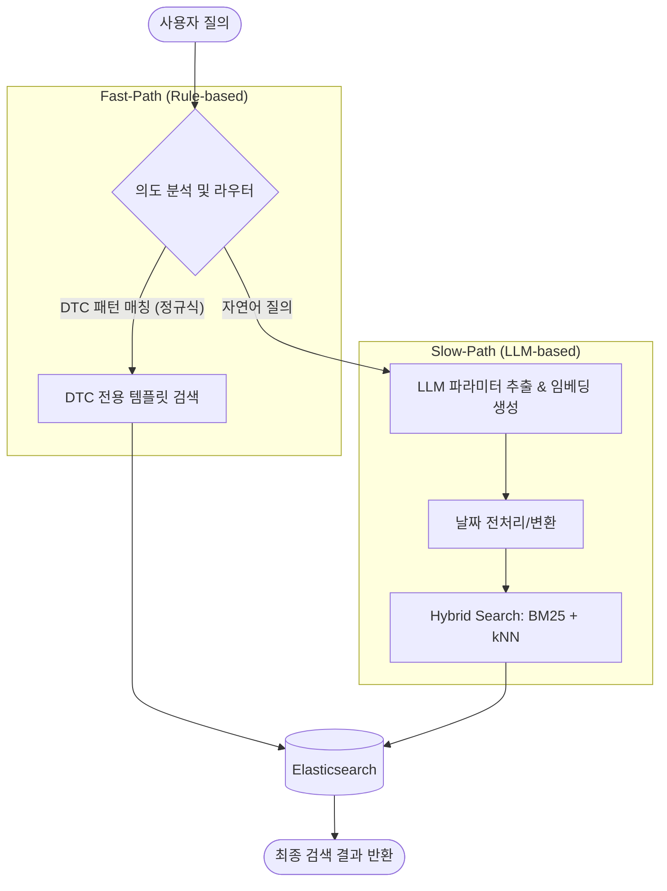

# 🚀 Elastic Hybrid Search 기반 의도 분석 및 정비 데이터 검색 API

차량 정비 데이터(Claims) 및 고장코드(DTC)를 분석하여 사용자 질의의 의도를 파악하고, **규칙 기반 라우팅(Rule-based Routing)**과 **LLM 기반 하이브리드 검색(Hybrid Search)**을 결합하여 최적의 검색 결과를 제공하는 FastAPI 백엔드 시스템입니다.

---

## 1. 시스템 아키텍처 (System Architecture)

본 시스템은 사용자의 입력에 따라 두 가지 경로로 처리됩니다.



---

## 2. 기술 스택 (Tech Stack)

| 구분 | 기술 | 주요 역할 |
| :--- | :--- | :--- |
| **Framework** | **FastAPI** | 비동기 API 엔드포인트 서빙 및 고성능 I/O 처리 |
| **Database** | **Elasticsearch** | Nori 분석기 기반 텍스트 검색 및 밀집 벡터(Dense Vector) 검색 |
| **AI/LLM** | **OpenAI API** | GPT-4o(의도/파라미터 추출), text-embedding-3-small(벡터 생성) |
| **Analysis** | **Nori Tokenizer** | 한국어 자동차 전문 용어 형태소 분석 및 검색 품질 최적화 |
| **Async I/O** | **AsyncElasticsearch** | 비동기 클라이언트를 통한 동시 요청 처리 효율 극대화 |

---

## 3. 핵심 기능 (Key Features)

### 3.1. 스마트 의도 분석 (Intent Analysis)
사용자의 질의를 5가지 카테고리로 자동 분류합니다:
*   `cause_analysis`: 고장 원인 분석
*   `trend_analysis`: 발생 추이 분석
*   `similar_case`: 유사 사례 검색
*   `supplier_analysis`: 협력사/공급사 분석
*   `dtc_analysis`: 고장코드 상세 정보 조회

### 3.2. 하이브리드 검색 알고리즘
*   **키워드 검색 (BM25)**: 형태소 분석을 통한 정확한 키워드 매칭.
*   **의미 검색 (kNN)**: 질의어의 맥락을 파악하여 텍스트가 일치하지 않아도 유사한 의미의 데이터 검색.
*   **필터링**: 모델명, 부품명, 날짜 범위(최근 6개월 등)를 정교하게 적용.

---

## 4. 디렉토리 구조 (Directory Structure)

```text
Analyer0.0/
├── app/
│   ├── api/          # API 엔드포인트 정의 (FastAPI Router)
│   ├── service/      # 검색 비즈니스 로직 및 ES 쿼리 빌더
│   ├── analyze/      # 의도 분석기 및 Fast/Slow 라우팅 로직
│   ├── llm/          # OpenAI 연동 (GPT, Embedding API)
│   ├── conn/         # Elasticsearch 비동기 클라이언트 관리
│   ├── utils/        # 날짜 파싱 및 공통 유틸리티
│   └── main.py       # FastAPI 앱 초기화 및 미들웨어 설정
├── scripts/          # 운영 및 관리를 위한 유틸리티 스크립트
│   ├── setup_es.py         # 인덱스 생성 및 매핑 초기화
│   ├── get_index_details.py # 현재 인덱스의 매핑 및 샘플 데이터 추출
│   └── check_mapping.py    # 인덱스 설정 상태 확인
├── main.py           # 애플리케이션 진입점 (uvicorn 실행부)
├── .env              # API 키 및 DB 접속 정보 (보안 주의)
├── requirements.txt  # 의존성 패키지 목록
└── test.http         # API 테스트 시나리오 (REST Client용)
```

---

## 5. 설치 및 설정 (Setup Guide)

### 5.1. 환경 변수 설정
`.env` 파일을 프로젝트 루트에 생성하고 아래 내용을 설정합니다.

```env
# OpenAI Configuration
OPENAI_API_KEY=your_api_key_here

# Elasticsearch Configuration
ES_HOST=http://localhost:9200
ES_USER=elastic
ES_PASSWORD=your_password
ES_INDEX_CLAIMS=jjc_claim_nori_v1
ES_INDEX_DTC=jjc_dtc_info_v1

# Server Configuration
PORT=8000
```

### 5.2. 필수 라이브러리 설치
```bash
pip install -r requirements.txt
```

### 5.3. Elasticsearch 인덱스 초기화
서버 실행 전, 필요한 인덱스와 분석기 설정을 완료해야 합니다.
```bash
python scripts/setup_es.py
```

---

## 6. 운영 스크립트 (Admin Scripts)

시스템 관리를 위해 제공되는 유틸리티들입니다.

*   **인덱스 상세 조회**: `scripts/index_info.json`에 현재 매핑과 샘플 데이터를 저장합니다.
    ```bash
    python scripts/get_index_details.py
    ```
*   **매핑 상태 확인**: 특정 필드의 데이터 타입과 설정을 콘솔에 출력합니다.
    ```bash
    python scripts/check_mapping.py
    ```

---

## 7. API 사용법 (Usage)

### **GET /**
*   서버 상태 확인용 엔드포인트

### **POST /api/data/search**
*   **Description**: 사용자의 자연어 질의를 분석하여 검색 결과 반환
*   **Request Body**:
    ```json
    {
      "query": "최근 6개월간 그랜저 엔진 진동 사례 찾아줘"
    }
    ```
*   **Response Body**:
    ```json
    {
      "intent": "cause_analysis",
      "route": "slow-path",
      "parameters": {
        "symptom": ["엔진 진동"],
        "model": "그랜저",
        "start_date": "20231113",
        "end_date": "20240513"
      },
      "results": [...],
      "total": 5
    }
    ```

---

## 8. 주의 사항 (Precautions)

1.  **Elasticsearch Nori Plugin**: ES 서버에 `analysis-nori` 플러그인이 반드시 설치되어 있어야 합니다.
2.  **OpenAI Quota**: 하이브리드 검색 시 임베딩 생성을 위해 OpenAI API를 호출하므로 할당량을 확인하세요.
3.  **Vector Dimension**: `text-embedding-3-small` 모델을 사용하여 1,536차원 벡터를 생성합니다. 인덱스 매핑의 `dims` 설정과 일치해야 합니다.