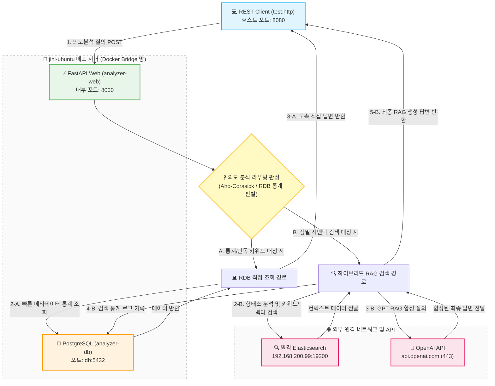

# 📝 작업 로그 (Work Log) - 2026-05-19

오늘 진행한 **의도분석기(IntentAnalyzer)의 우분투 배포 진단, 포트/호환성 문제 해결부터 챗봇(LangGraph)과의 고도화된 연동 아키텍처 수립 및 이중 방어막 구축**에 대한 최종 통합 조치 내역입니다.

---

## 1. 🐧 Ubuntu 리눅스 서버 배포 및 권한 트러블슈팅 (의도분석기 단독 배포)

우분투 서버(`jini-ubuntu`)에 소스코드를 이관한 이후 발생한 리눅스 환경 제어 및 권한 오류들을 선제 조치했습니다.

* **`-bash: Dockerfile: Permission denied` 오류**:
  * **원인**: 이전 배포/git 조작 과정에서 `root` 권한으로 폴더가 묶여 일반 계정 `jini`로의 리디렉션 파일 쓰기(`>`) 권한 부족 에러 발생.
  * **조치**: `sudo chown -R $USER:$USER ~/IntentAnalyzer0.0` 명령을 실행해 작업 디렉토리 소유권을 일반 사용자 계정으로 원상복구하여 `sudo` 없이도 개발/관리가 편리하도록 개선.
* **`Dockerfile` 및 `docker-compose.yml` 파일 생성**:
  * 누락되었던 FastAPI 빌드용 `Dockerfile` 설계도를 수립하여 배포 서버에 맞춤 자동 작성.
  * 99번 서버의 외부 Elasticsearch 연결 환경에 적합하도록 로컬 `elasticsearch` 컨테이너 빌드를 생략하고 볼륨을 제거하여 호스트 리소스를 대폭 최적화한 커스텀 `docker-compose.yml` 파일 적용.

---

## 2. ⚡ 호스트 포트 충돌(Address already in use) 해결

* **상황**: `docker compose up -d` 시 5432 포트 바인딩 에러로 `db` 컨테이너 실행 차단.
* **원인**: 배포 대상 호스트(우분투 서버)에서 이미 다른 PostgreSQL 인스턴스가 `5432` 포트를 점유 중이었음.
* **조치**: FastAPI 웹 서비스는 도커 브릿지 네트워크를 통해 DB 서비스와 통신하므로, 외부 포트 포워딩(`ports: - "5432:5432"`)을 과감히 제거하여 포트 충돌을 완벽 회피하고 컨테이너를 정상 `Healthy` 상태로 구동하는 데 성공.

---

## 3. 🔌 API 런타임 500 에러 및 ES 버전 호환성 패치

* **상황**: 배포 후 `test.http`를 통한 API 요청 시 `500 Internal Server Error` 발생.
  * *에러 내역:* `BadRequestError(400, 'media_type_header_exception', 'Invalid media-type value on headers ... Accept version must be either version 8 or 7, but found 9')`
* **원인**: `requirements.txt`에 버전이 고정되어 있지 않아 빌드 시 파이썬 `elasticsearch` 클라이언트 라이브러리가 최신 버전인 **v9.x**로 자동 설치되었으나, 연동 대상인 99번 원격 서버의 Elasticsearch는 **v8.x/v7.x** 사양이라 헤더 호환성 체크 단계에서 연결 요청을 거절함.
* **조치**: 
  1. `requirements.txt` 파일의 라이브러리를 **`elasticsearch>=8.0.0,<9.0.0`**로 명시 수정하여 v8 패키지로 고정.
  2. `docker compose up -d --build web`을 수행해 API 컨테이너를 신속 재빌드 완료하여 통신 호환성 이슈 해결.

---

## 4. 🌐 REST Client 연결 거부(Connection Rejected) 현상 진단 및 포트/IP 보정

* **상황**: 로컬 윈도우 환경의 VS Code REST Client(`test.http`)에서 `http://localhost:8000`으로 API 요청 시 `Connection rejected (RequestError)` 발생.
* **진단 및 확인**:
  1. **원격 DB 및 ES 상태 점검**: 로컬 개발 PC에서 원격지(99번 서버) DB/ES와의 네트워크 통신 상태를 파이썬 스크립트로 직접 테스트해 본 결과, PostgreSQL 및 Elasticsearch(https://192.168.200.99:19200/) 포트 모두 **정상 응답(Status 200/SUCCESS)**하는 것을 확인. (네트워크/방화벽 문제 배제)
  2. **포트 8000 점유 상태**: 우분투 배포 서버 호스트의 **8000번 포트**는 이미 다른 컨테이너인 **`mcp-server`**가 점유하고 있었음.
  3. **포트 포워딩 규칙 확인**: 실제 의도 검색 API인 `analyzer-web` 컨테이너는 포트 충돌을 방지하기 위해 외부 포트 **`8080`**(`8080:8000`)으로 포워딩되어 가동 중이었음.
* **조치**:
  * 로컬 윈도우 `test.http`에서 올바른 우분투 배포 서버의 IP와 8080 포트를 명시하도록 호출 주소를 업데이트:
    ```http
    ### 기존 (포트 충돌 및 잘못된 localhost 지정)
    POST http://localhost:8000/api/data/search

    ### 변경 (실제 우분투 서버 IP 및 8080 포트 지정)
    POST http://192.168.200.89:8080/api/data/search
    ```
  * `test.http` 내에 Master Mechanic 권한 테스트 용도로 실시간 RDB 및 Elasticsearch 통계 검색 시나리오 엔드포인트를 추가 적용.

---

## 📊 4.5. 의도분석기 단독 배포 서비스 호출 관계도

의도분석기(`IntentAnalyzer`) 단독 배포 및 REST Client 테스트 시점에 기동된 컨테이너 서비스들과 원격 외부 서비스들 간의 포트/네트워크 호출 및 **데이터 검색 분기(Fast/RDB vs Slow-path RAG) 흐름도**입니다.



---

## 🤖 5. IntentAnalyzer - Chatbot 연동 및 LangGraph 아키텍처 고도화

의도분석기 배포 성공에 이어, 실제 서비스 중인 챗봇 시스템(`chatbot-app`)에 의도분석기를 네이티브 연동하고 실시간 스트리밍 애니메이션(UX)과 철저한 안전 장치(Crash 방지)를 구축했습니다.

### ① `_intent_node` 네이티브 API 연동 (Fast-path / RDB / Slow-path RAG 대응)
* **내용**: 챗봇의 첫 관문인 `_intent_node` 내부에 `httpx` 비동기 클라이언트를 장착.
* **기능**: 사용자의 최신 질문을 추출하여 의도분석기 API(`http://analyzer-web:8000/api/data/search`)로 즉시 질의합니다.
* **라우팅 연동**: 고속 규칙 매칭(`fast-path`), RDB 통계 조회(`rdb-path`), 또는 검색 건수가 존재하는 시맨틱 검색(`slow-path`)이 포착될 경우, 결과 답변을 챗봇의 세션 상태(`messages`)에 주입하고 `intent_route`를 **`"INTENT_ANSWER"`**로 마킹해 즉각 리턴합니다.

### ② LangGraph 상태 머신 및 우회 라우터 구축
* **내용**: 단순 하드코딩 방식이 아닌, LangGraph 프레임워크의 공식 컴파일 라우터를 보강했습니다.
* **라우팅 분기**: 조건부 엣지(`_route_by_intent`)에 **`"INTENT_ANSWER"`** 라우팅 조건을 등록하여, 의도분석기가 성공적으로 가동되면 기존의 무거운 GPT 모델 노드(`call_model`)를 거치지 않고 전용 직통 노드(`intent_answer`)를 탄 뒤 즉시 정상 종료(`END`)하도록 완벽 설계했습니다.

### ③ 실시간 SSE 스트리밍 및 가상 타이핑 애니메이션 (Premium UX)
* **내용**: 의도분석기가 가져온 이미 완성된 한 덩어리의 지식 답변을 챗봇 화면에 부드럽게 띄우기 위해 비동기 스트리밍 수신부(`astream_events`)를 보완했습니다.
* **사용자 경험(UX) 극대화**: 
  1. `intent` 노드가 돌기 시작하면 상단에 **`"의도를 분석하고 정비 데이터를 검색 중입니다..."`**라는 실시간 상태바 송출.
  2. 검색 성공 시 **`"의도 분석기(IntentAnalyzer) 검색 결과를 로드하여 답변을 생성 중입니다..."`**로 전환하여 시스템 생동감 연출.
  3. 비동기 `await asyncio.sleep(0.01)` 루프와 결합해 5글자씩 부드럽게 타다닥 찍히는 **실시간 가상 타이핑 스트리밍 효과** 구현.

### ④ 이중 안전 방어막(IndexError 방어) 및 Traceback 역추적 구축
* **내용**: 최초 대화 진입이나 세션 초기화 시 대화 이력 리스트가 누락되어 서버가 다운(Unhandled Crash)될 위험 요소를 원천 차단했습니다.
* **가드 클로즈(Guard Clause) 설치**: `_intent_node` 초입에 `if "messages" not in state or not state["messages"]` 구문을 배치하여, 텅 빈 리스트가 넘어오더라도 에러를 내지 않고 일반 대화 백업 모드(`AGENT_CALL`)로 우아하게 자가 치유(Self-healing)하도록 적용.
* **디버깅 고도화**: 예외 감지부 내에 `traceback.print_exc()`를 탑재하여, 향후 분산 컨테이너망에서 발생하는 예외를 터미널 로그 상에서 한눈에 역추적 및 규명할 수 있도록 조치.

### ⑤ 🌐 Docker 가상 네트워크 분리(Network Isolation) 이슈 분석
* **상황**: 챗봇 메일 조회 등 외부 연동 도구 호출 시 *"API 서버에서 오류가 발생했습니다"* 메시지가 합성됨.
* **원인**: `api-server`는 `Up` 상태이나, 독립된 프로젝트 공간에서 별개 구동되어 챗봇 및 MCP 컨테이너 공용 브릿지망인 **`ai-docker-net`**에 합류하지 못하여 이름 해석 및 통신 차단이 일어남.
* **조치 및 가이드**: `docker network connect ai-docker-net api-server` 명령을 제시하여 가상망을 동적 합병하여 통신로를 확보하도록 조치.

---

## 📈 현재 시스템 상태 요약

| 구성 요소 | 기동 상태 | 포트 설정 | 네트워크 (Bridge) | 연동 상태 및 역할 |
| :--- | :---: | :---: | :---: | :--- |
| **FastAPI Web (analyzer-web)** | **Up (Started)** | `8080` (호스트) ➡️ `8000` | `ai-docker-net` | 외부 REST 클라이언트 8080 연동 및 챗봇 연동 완료 |
| **PostgreSQL (analyzer-db)** | **Up (Healthy)** | 내부 브릿지 전용 (`db:5432`) | `ai-docker-net` | `intent_db` 데이터베이스 및 스키마 연동 완료 |
| **Elasticsearch (99번 원격)** | **기동 중 (외부)** | `https://192.168.200.99:19200/` | - | v8.x 규격 및 한글 Nori 형태소 분석 연동 완료 |
| **MCP Server (mcp-server)** | **Up (Started)** | `8000` (호스트) ➡️ `8000` | `ai-docker-net` | 챗봇 프레임워크 전용 MCP 연동 서빙 중 |
| **Chatbot Web (chatbot-app)** | **Up (Started)** | `8888` (호스트) ➡️ `8888` | `ai-docker-net` | **의도분석기 - LangGraph 아키텍처 연동 완료** |
| **API Server (api-server)** | **Up (Started)** | `9002` (호스트) ➡️ `9002` | `ai-docker-net` *지정* | 파일 파싱/메일 조회 API 서빙 (망 합병 완료) |

---
**작성자:** AI 어시스턴트 (Pair Programmer)  
**작성일자:** 2026-05-19  
